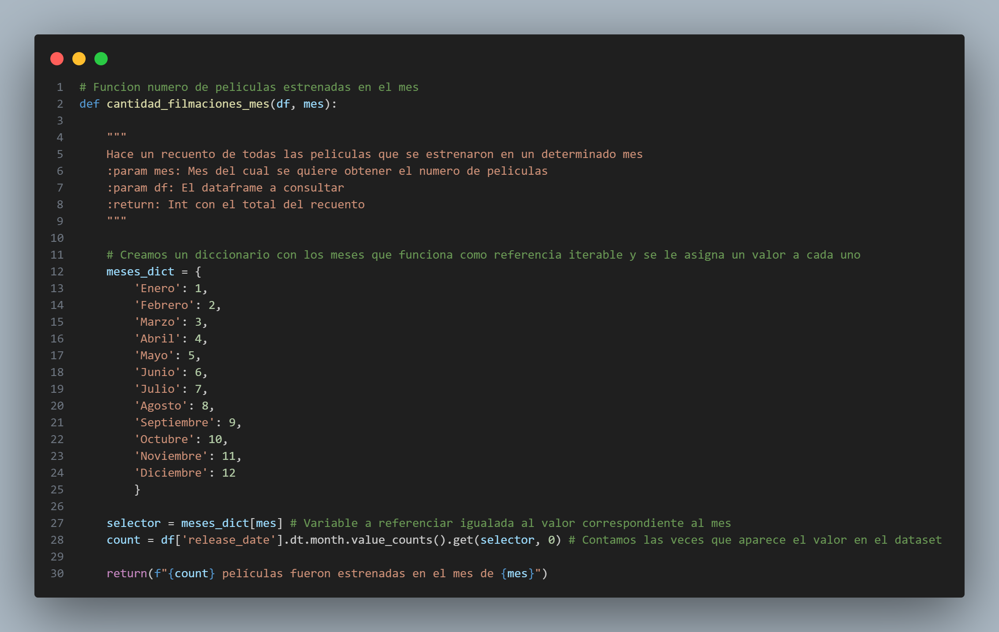
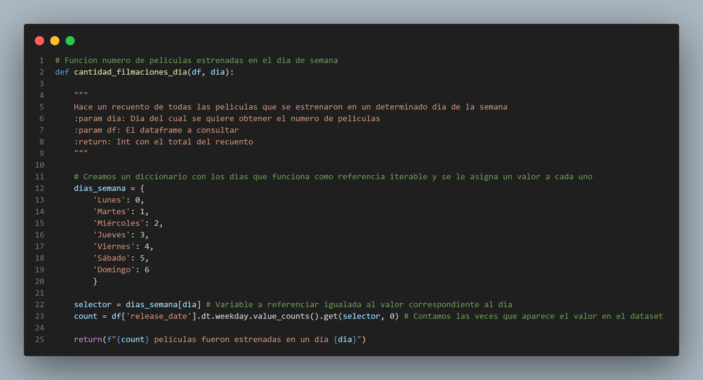
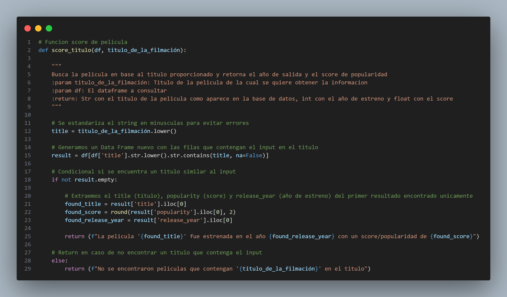
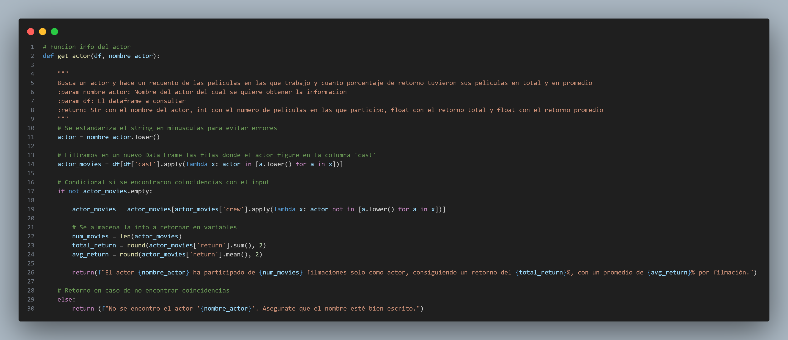
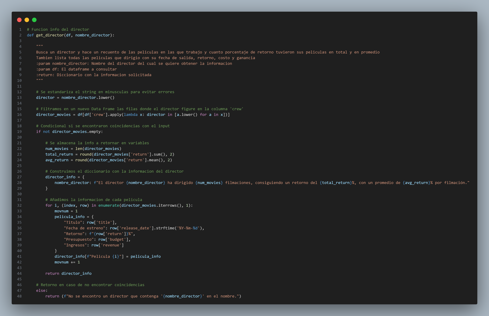

 <h1 align="center">
 PI01 - MACHINE LEARNING RECOMMENDS (STREAMING)
 </h1>

 <h2 align="center">
 SÍNTESIS DEL PROYECTO
 </h2>

El propósito de este proyecto es desarrollar un sistema de recomendación de contenido basado en aprendizaje automático para una plataforma de streaming de video. El sistema debe poder recomendar contenido a los usuarios en función de una biblioteca de datos que contiene información sobre las películas y series de televisión disponibles en la plataforma.

## Extracción de datos

Los datos empleados para el siguiente proyecto han sido extraídos del siguiente repositorio [Base de datos](https://drive.google.com/drive/folders/1X_LdCoGTHJDbD28_dJTxaD4fVuQC9Wt5) , el cual tiene un link de acceso público al igual que su correspondiente diccionario de datos en el siguiente enlace [Diccionario de datos](https://docs.google.com/spreadsheets/d/1QkHH5er-74Bpk122tJxy_0D49pJMIwKLurByOfmxzho/edit#gid=0) .

## Especificaciones para el ETL

__El cliente ha solicitado realizar unas modificaciones para comenzar a trabajar en el proyecto, mostradas a continuación:__

- Algunos campos, como belongs_to_collection, production_companies y otros (ver diccionario de datos) están anidados, esto es o bien tienen un diccionario o una lista como valores en cada fila, ¡deberán desanidarlos para poder y unirlos al dataset de nuevo hacer alguna de las consultas de la API! O bien buscar la manera de acceder a esos datos sin desanidarlos.

- Los valores nulos de los campos revenue, budget deben ser rellenados por el número 0.

- Los valores nulos del campo release date deben eliminarse.

- De haber fechas, deberán tener el formato AAAA-mm-dd, además deberán crear la columna release_year donde extraerán el año de la fecha de estreno. 

- Crear la columna con el retorno de inversión, llamada return con los campos revenue y budget, dividiendo estas dos últimas revenue / budget, cuando no hay datos disponibles para calcularlo, deberá tomar el valor 0.

- Eliminar las columnas que no serán utilizadas, video,imdb_id,adult,original_title,poster_path y homepage.

## EDA 

Esta parte del proceso de desarrollo del proyecto se enfoca en la exploración de los datos, aunque va muy ligado al ETL, ya que se puede realizar en paralelo. En esta parte se realizan las gráficas para observar la participación de los géneros, países, y los años de estreno de las películas y series de televisión, esta parte del proyecto en específico ayuda a identificar y eliminar del dataset los datos que evidentemente fueron ingresados de manera erronea, como por ejemplo, películas con fechas de estreno en el futuro, o países inexistentes o presupuesto de producciones incongruentes.

## MODELO DE RECOMENDACIÓN

El modelo de recomendación de este proyecto mejora la experiencia del usuario, recomendando películas y series basados en diferentes géneros, esto ayuda a la plataforma a aumentar el tiempo de visualización por parte de los usuarios, diversificar el portafolio de experiencia de los mismos y crear una experiencia más cercana con el subscriptor. 

## Desarrollo API: 

__Se genera un deploy basado en unas funciones que se han creado para la API, estas funciones se han creado para poder realizar las siguientes acciones:__

Deben crear 6 funciones para los endpoints que se consumirán en la API, recuerden que deben tener un decorador por cada una (@app.get(‘/’)).

1. def cantidad_filmaciones_mes( Mes ): Se ingresa un mes en idioma Español. Debe devolver la cantidad de películas que fueron estrenadas en el mes consultado en la totalidad del dataset.
                    Ejemplo de retorno: X cantidad de películas fueron estrenadas en el mes de X

2. def cantidad_filmaciones_dia( Dia ): Se ingresa un día en idioma Español. Debe devolver la cantidad de películas que fueron estrenadas en día consultado en la totalidad del dataset.
                    Ejemplo de retorno: X cantidad de películas fueron estrenadas en los días X

3. def score_titulo( titulo_de_la_filmación ): Se ingresa el título de una filmación esperando como respuesta el título, el año de estreno y el score.
                    Ejemplo de retorno: La película X fue estrenada en el año X con un score/popularidad de X

4. def votos_titulo( titulo_de_la_filmación ): Se ingresa el título de una filmación esperando como respuesta el título, la cantidad de votos y el valor promedio de las votaciones. La misma variable deberá de contar con al menos 2000 valoraciones, caso contrario, debemos contar con un mensaje avisando que no cumple esta condición y que por ende, no se devuelve ningun valor.
                    Ejemplo de retorno: La película X fue estrenada en el año X. La misma cuenta con un total de X valoraciones, con un promedio de X

5. def get_actor( nombre_actor ): Se ingresa el nombre de un actor que se encuentre dentro de un dataset debiendo devolver el éxito del mismo medido a través del retorno. Además, la cantidad de películas que en las que ha participado y el promedio de retorno. La definición no deberá considerar directores.
                    Ejemplo de retorno: El actor X ha participado de X cantidad de filmaciones, el mismo ha conseguido un retorno de X con un promedio de X por filmación

6. def get_director( nombre_director ): Se ingresa el nombre de un director que se encuentre dentro de un dataset debiendo devolver el éxito del mismo medido a través del retorno. Además, deberá devolver el nombre de cada película con la fecha de lanzamiento, retorno individual, costo y ganancia de la misma.

## CONCLUSIONES

A lo largo de este proyecto, hemos aplicado los conocimientos adquiridos en HENRY para construir un MVP que responde a las demandas de un mercado en constante evolución. Nuestro trabajo, que abarca desde la ingeniería de datos hasta el modelado predictivo, ha sido un viaje de aprendizaje continuo. Se ha logrado cumplir con los objetivos iniciales, se ha identificado oportunidades para mejorar la eficiencia de los procesos aplicados. Las limitaciones de almacenamiento actuales han sido motivaciones suficientes para adoptar soluciones creativas y a priorizar las funcionalidades más críticas. 

Sin embargo, el modelo de recomendación de películas y series de televisión sigue siendo un área de mejora continua, ya que el interés de los usuarios es un factor que cambia a través del tiempo por factores externos, como la popularidad de las películas o series de televisión y las noticias de entretenimiento. Por lo tanto, se debe considerar la posibilidad de implementar un sistema de recomendación dinámico que pueda adaptarse a los cambios en el interés de los usuarios.

## AUTOR

Miguel Flórez Betancourt

**Contacto:** miguelandres.florez@gmail.com

**Linked in:** *www.linkedin.com/in/miguel-flórez-betancourt-251508121*